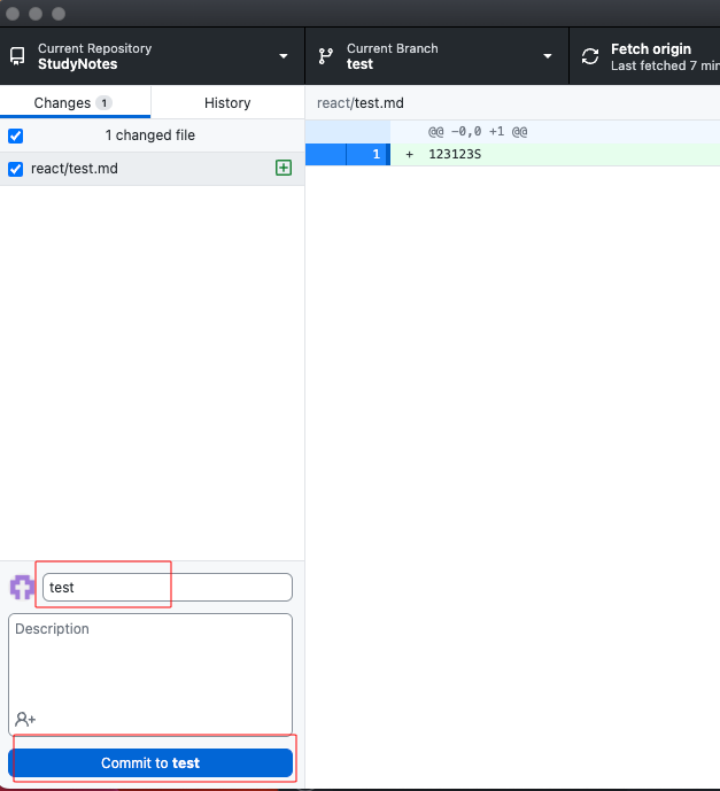
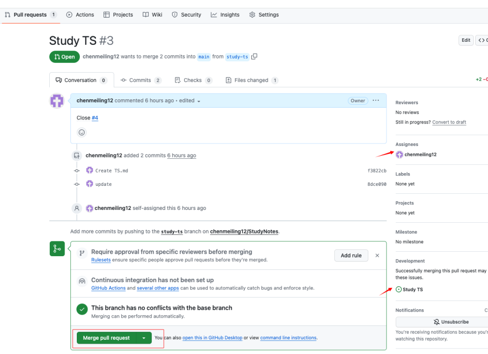

##itlab 与 Sourcetree 的使用流程

####1.新建里程

####2.新建分支

分支创建成功

####3.创建 issues

issues 创建成功(为了关联 pr)

####4.创建 pr

pr 创建成功

####5.分支同步到 Sourcetree

####6.右击->检出，分支移出本地，双击每个分支可切换

####7.拉取代码

####8.在本地写代码

####9.查看本地修改过的代码

####10.提交—>推送

s
pr

