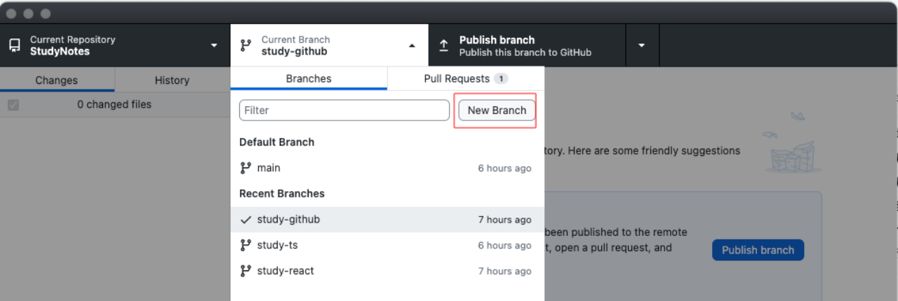
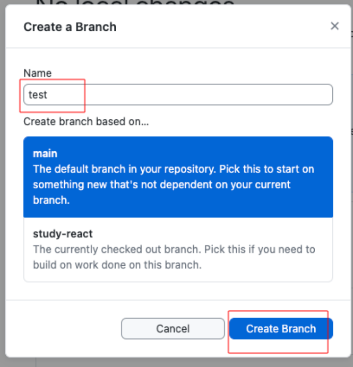
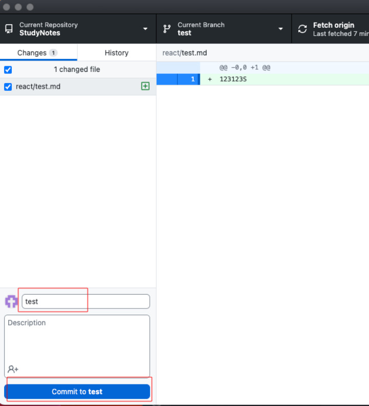
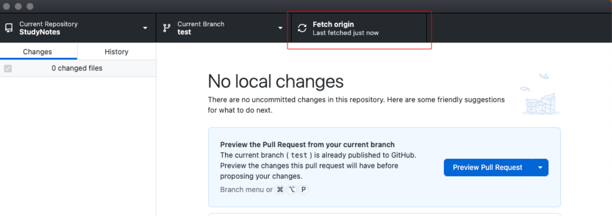
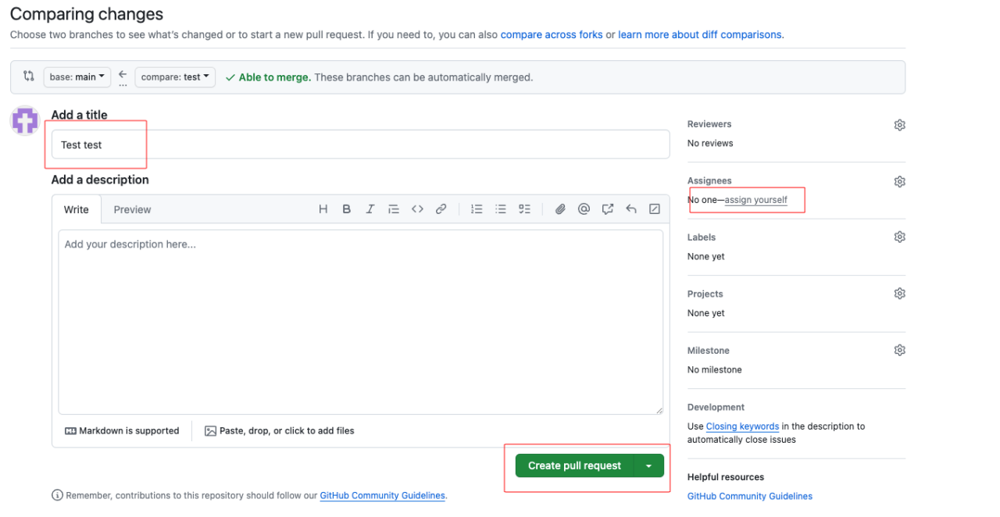
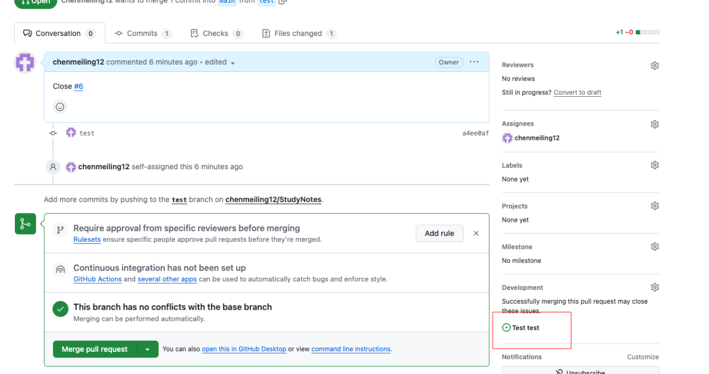
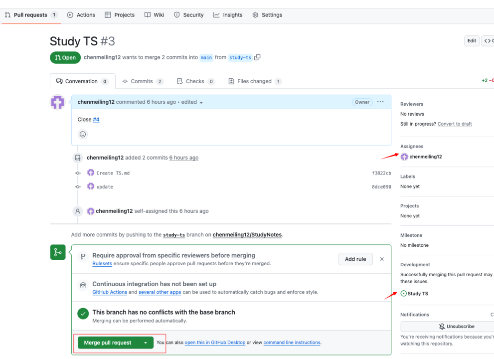
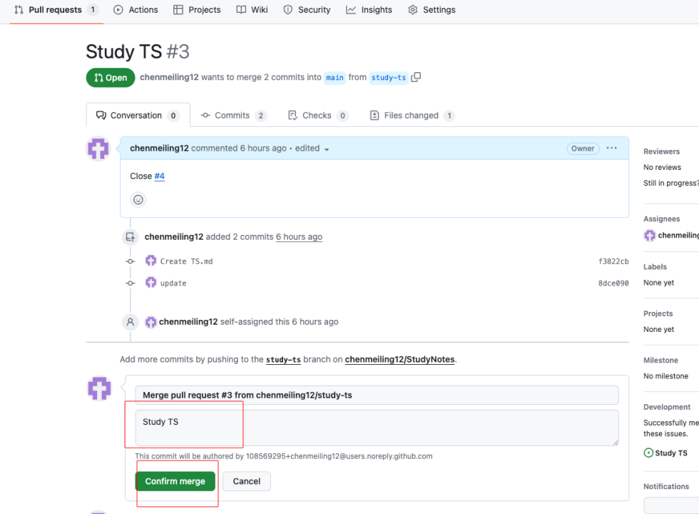

## gitHub 与 gitHub Desktop 使用流程

#### 1.创建仓库

#### 2.复制链接到 github desktop 克隆

#### 3.新建分支(分支名称以小写字母和-组成，name 或 git-name)

#### 4.在 vscode 中新建文件保存

#### 5.描述该分支的作用

#### 6.推到 github 上

#### 7.推送成功后在 github 创建 pr

#### 8.创建 pr，pr 名称首字母要大写，多个字母用空格

#### 9.创建 issues,名称同 pr 一样

issues 创建成功

#### 10.pr 关联 issues

Close 要大写

关联成功标识

#### 11.合并到主分支

